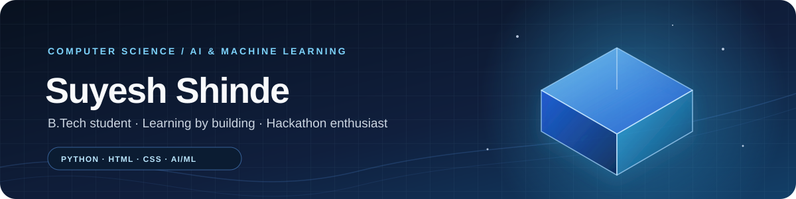

  
   
  

## Hi, I'm Suyesh 👋

I'm pursuing a **B.Tech in Artificial Intelligence and Machine Learning**. I enjoy turning ideas into projects, learning by building, and meeting new challenges at hackathons.

### What I'm working on

- Learning **Python**, **HTML**, and **CSS**
- Building projects to strengthen my programming and AI/ML foundations
- Taking part in hackathons and learning with a team

### Tools I'm learning

  
  
  
  

### Featured project

🌐 **[My 3D portfolio](https://github.com/suyeshshinde2335-ai/suyesh-portfolio)** — an interactive portfolio website introducing me and my work.

### Let's connect

Have a project idea or a hackathon coming up? [Find me on GitHub](https://github.com/suyeshshinde2335-ai) — I'm always glad to learn and build with others.

### 🐍 Contribution activity

<picture>
  <source media="(prefers-color-scheme: dark)" srcset="https://raw.githubusercontent.com/suyeshshinde2335-ai/suyeshshinde2335-ai/output/github-snake-dark.svg" />
  <source media="(prefers-color-scheme: light)" srcset="https://raw.githubusercontent.com/suyeshshinde2335-ai/suyeshshinde2335-ai/output/github-snake.svg" />
  
</picture>
