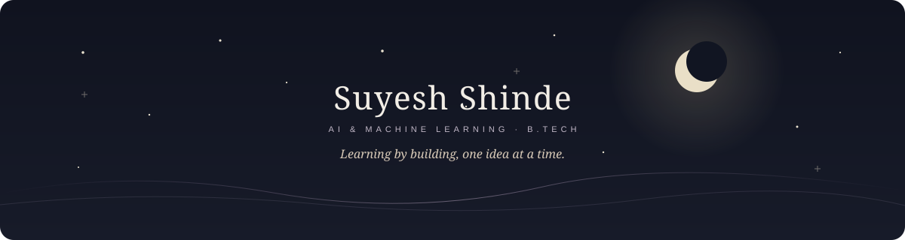
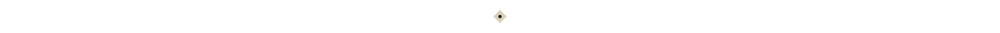

  

<em>“Build quietly. Keep looking up.”</em>

### ❦ The Prologue

I’m Suyesh Shinde, currently pursuing a **B.Tech in Artificial Intelligence and Machine Learning**. I like turning curiosity into small, useful projects and learning by building.

I’m learning **Python, HTML, and CSS**, strengthening my AI/ML foundations, and taking part in hackathons where ideas become team projects.

### ☾ This Season

**Learning**
- Python, HTML, and CSS
- AI/ML foundations and problem solving
- Learning through projects and hackathons

**Building**
- [3D portfolio](https://github.com/suyeshshinde2335-ai/suyesh-portfolio)
- [Terminal Adventure Game](https://github.com/suyeshshinde2335-ai/terminal-adventure-game)
- [ChallanSwift](https://github.com/suyeshshinde2335-ai/challanswift)

### ✧ Celestial Atlas

Still learning, still charting.
Every project teaches me something new.
The next idea is always somewhere over the horizon.

### ✦ Constellation

  
  
  
  

### ⌘ Marginalia

> “Curiosity gets stronger when you give it something to build.”

Hackathons remind me how far an idea can go when people build it together.

### ✧ The Observatory

A few things I’ve been working on:

- [3D portfolio](https://github.com/suyeshshinde2335-ai/suyesh-portfolio) — an interactive introduction to my work.
- [Terminal Adventure Game](https://github.com/suyeshshinde2335-ai/terminal-adventure-game) — a Python story game with branching choices.
- [ChallanSwift](https://github.com/suyeshshinde2335-ai/challanswift) — a Python vehicle challan lookup project.
- [Rogue AI Terminal](https://github.com/suyeshshinde2335-ai/Rogue-AI-Terminal) — a cyberpunk-style terminal interface.

### ☾ Night Garden

<picture>
  <source media="(prefers-color-scheme: dark)" srcset="https://raw.githubusercontent.com/suyeshshinde2335-ai/suyeshshinde2335-ai/output/github-snake-dark.svg" />
  <source media="(prefers-color-scheme: light)" srcset="https://raw.githubusercontent.com/suyeshshinde2335-ai/suyeshshinde2335-ai/output/github-snake.svg" />
  
</picture>

<em>Small steps, repeated, leave a trail.</em>

### 🌒 Next Horizon

- Keep learning Python and web development.
- Build projects that strengthen my AI/ML foundations.
- Join hackathons, collaborate, and keep improving.

### ☾ Epilogue

There are always more things to learn, and more ideas worth making real.

✦ THANK YOU FOR STOPPING BY ✦

